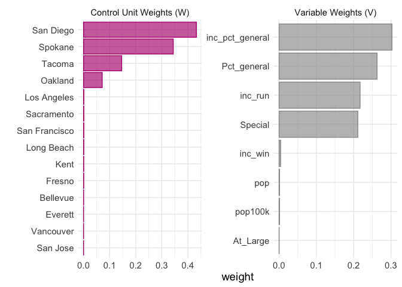
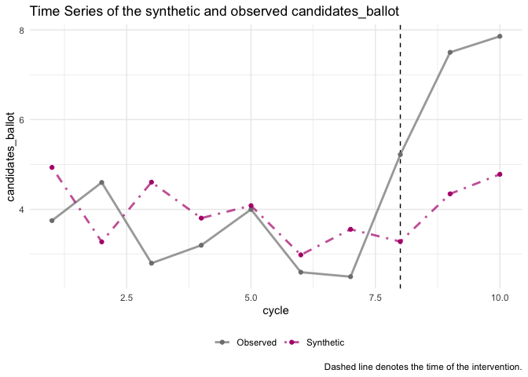
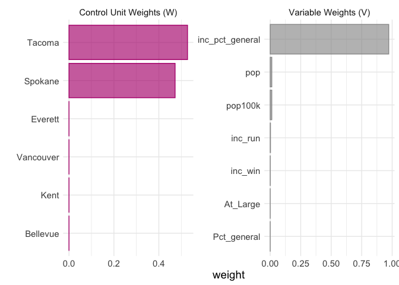
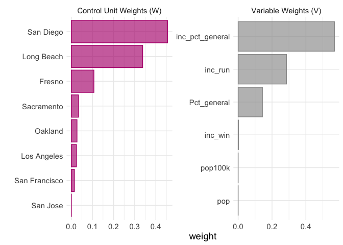
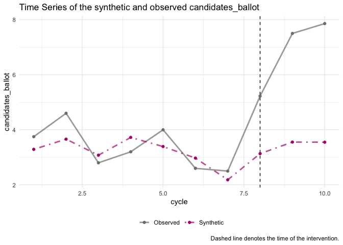

### Setup


```r
here::i_am("HW4/HW4.Rmd")
```

```
## here() starts at /Users/johannaallen/Documents/Erik/ECON 587
```

```r
# Load packages
pacman::p_load(tidyverse, magrittr, estimatr, fixest, plm, systemfit, tidysynth)
```


```r
# Load data
election_df = haven::read_dta(here::here("HW4", "data", "GriffithNoonen2022_Econ587.dta"))
```

### Question 1

Note: lm_robust and feols seem to calculate clustered standard errors differently. Feols matches those from the paper, but I've use both based on convenience and when I don't have a standard error to match I defer to lm_robust. 

#### a)


```r
# Generate treatment dummy and city/cycle pair for clustering
election_df %<>% mutate(post = if_else(cycle >= 2017, 1, 0), 
                        treatment = if_else(city == 'Seattle', 1, 0),
                        city_cycle = as.factor(city):as.factor(cycle),
                        seattle = if_else(city == 'Seattle', 1, 0))

# Run naive regression
election_df %>% lm_robust(candidates_ballot ~ treatment + At_Large*Special,., clusters = city_cycle)
```

```
##                   Estimate Std. Error   t value     Pr(>|t|)   CI Lower
## (Intercept)       3.589078  0.1463080 24.530968 1.197745e-46  3.2991600
## treatment         1.909594  0.5449885  3.503915 6.077719e-03  0.6879128
## At_Large         -1.413736  0.2442275 -5.788605 1.490323e-06 -1.9096278
## Special           2.310922  0.6487738  3.561985 1.144109e-03  0.9909783
## At_Large:Special -2.349963  0.8527678 -2.755689 1.852349e-02 -4.2243034
##                    CI Upper         DF
## (Intercept)       3.8789950 111.057535
## treatment         3.1312742   9.573626
## At_Large         -0.9178450  34.836368
## Special           3.6308667  32.997352
## At_Large:Special -0.4756222  11.125935
```

#### b)


```r
# Before and after treatment for seattle
(before_after_seattle = election_df |> filter(city == 'Seattle') %>%
  lm_robust(candidates_ballot ~ post + At_Large*Special,., clusters = city_cycle))
```

```
## 1 coefficient  not defined because the design matrix is rank deficient
```

```
##                   Estimate Std. Error   t value   Pr(>|t|)  CI Lower  CI Upper
## (Intercept)       5.032967  0.5848685  8.605297 0.07139585 -2.130380 12.196314
## post              3.076923  0.7193253  4.277512 0.13842535 -5.227067 11.380913
## At_Large         -1.494505  0.5541174 -2.697092 0.17503886 -5.566441  2.577430
## Special          -1.538462  0.3047218 -5.048741 0.00144325 -2.257731 -0.819192
## At_Large:Special        NA         NA        NA         NA        NA        NA
##                        DF
## (Intercept)      1.015827
## post             1.042542
## At_Large         1.315985
## Special          7.062124
## At_Large:Special       NA
```

```r
# Before and after for non-seattle cities
(before_after_other = election_df |> filter(city != 'Seattle') %>%
  lm_robust(candidates_ballot ~ post + At_Large*Special,., clusters = city_cycle))
```

```
##                    Estimate Std. Error   t value     Pr(>|t|)   CI Lower
## (Intercept)       3.4776955  0.1688514 20.596186 2.878122e-36  3.1423533
## post              0.4148275  0.2448961  1.693892 9.845735e-02 -0.0809163
## At_Large         -1.2231610  0.1989526 -6.148004 7.846422e-07 -1.6288208
## Special           2.3497096  0.6516426  3.605825 1.012284e-03  1.0240282
## At_Large:Special -2.2941949  0.8476360 -2.706580 2.349678e-02 -4.2028308
##                    CI Upper        DF
## (Intercept)       3.8130378 92.231960
## post              0.9105713 38.052344
## At_Large         -0.8175012 31.202301
## Special           3.6753911 33.062712
## At_Large:Special -0.3855589  9.282206
```

```r
# Diff between
summary(before_after_seattle)$coefficients[2,1] - summary(before_after_other)$coefficients[2,1]
```

```
## 1 coefficient  not defined because the design matrix is rank deficient
```

```
## [1] 2.662096
```

#### c)


```r
# Cross sectional estimate before 2017
(cross_before = election_df |> filter(post == 0) %>%
  lm_robust(candidates_ballot ~ seattle + At_Large*Special,., clusters = city_cycle))
```

```
##                   Estimate Std. Error   t value     Pr(>|t|)   CI Lower
## (Intercept)       3.483982  0.1717835 20.281238 7.342703e-35  3.1425797
## seattle           1.311372  0.3306454  3.966099 3.579362e-03  0.5581377
## At_Large         -1.249706  0.2109556 -5.924024 3.111992e-06 -1.6835384
## Special           2.334200  0.7198830  3.242471 3.263548e-03  0.8538710
## At_Large:Special -2.453704  0.9915090 -2.474717 3.957582e-02 -4.7562457
##                    CI Upper        DF
## (Intercept)       3.8253838 87.660223
## seattle           2.0646072  8.605266
## At_Large         -0.8158744 25.748241
## Special           3.8145291 25.789416
## At_Large:Special -0.1511626  7.690471
```

```r
# Cross-Sectional Estimate after 2017
(cross_after = election_df |> filter(post == 1) %>%
  lm_robust(candidates_ballot ~ seattle + At_Large*Special,., clusters = city_cycle))
```

```
##                   Estimate Std. Error   t value     Pr(>|t|)    CI Lower
## (Intercept)       3.888271  0.2287718 16.996285 6.156804e-14   3.4131578
## seattle           4.152392  0.4157658  9.987334 4.508960e-02   0.3551595
## At_Large         -1.182981  0.4156373 -2.846186 2.838772e-02  -2.1928444
## Special           2.397443  1.6596647  1.444535 1.943128e-01  -1.5753525
## At_Large:Special -2.602733  1.7392122 -1.496501 2.802489e-01 -10.5328616
##                    CI Upper        DF
## (Intercept)       4.3633840 21.478005
## seattle           7.9496236  1.166224
## At_Large         -0.1731178  6.180707
## Special           6.3702393  6.603234
## At_Large:Special  5.3273952  1.886855
```

```r
# Diff between
summary(cross_after)$coefficients[2,1] - summary(cross_before)$coefficients[2,1]
```

```
## [1] 2.841019
```


#### d)


```r
# Diff-in-Diff
(diff_in_diff = election_df %>% lm_robust(candidates_ballot ~ post*treatment + At_Large*Special,., clusters = city_cycle)) # 2.8
```

```
##                    Estimate Std. Error   t value     Pr(>|t|)    CI Lower
## (Intercept)       3.4816344  0.1670719 20.839143 5.446786e-37  3.14990526
## post              0.4160744  0.2446621  1.700608 9.717398e-02 -0.07919012
## treatment         1.3031499  0.3317399  3.928227 3.706416e-03  0.54870655
## At_Large         -1.2364427  0.1855647 -6.663136 1.354194e-07 -1.61390204
## Special           2.3455525  0.6512075  3.601851 1.024071e-03  1.02072331
## post:treatment    2.8516842  0.5369667  5.310728 4.185045e-02  0.28116922
## At_Large:Special -2.4826566  0.8282304 -2.997543 1.198253e-02 -4.30287937
##                    CI Upper        DF
## (Intercept)       3.8133636 93.911451
## post              0.9113388 38.065564
## treatment         2.0575932  8.697657
## At_Large         -0.8589834 33.173207
## Special           3.6703818 33.040951
## post:treatment    5.4221991  1.802658
## At_Large:Special -0.6624338 11.135367
```

```r
# Coeff of interest is post:treatment
```

#### e)


```r
# two way fixed effects. We're switching regression functions here because it has prettier output, and seems to calculate standard errors in a slightly different way that matches the paper
(two_way = election_df %>% feols(candidates_ballot ~ post*treatment | as.factor(city) + as.factor(cycle) + At_Large*Special,., cluster = "city_cycle"))# Point estimate and se match
```

```
## The variable 'post' has been removed because of collinearity (see $collin.var).
```

```
## OLS estimation, Dep. Var.: candidates_ballot
## Observations: 688 
## Fixed-effects: as.factor(city): 15,  as.factor(cycle): 10,  At_Large: 2,  Special: 2,  At_Large:Special: 2
## Standard-errors: Clustered (city_cycle) 
##                Estimate   Std. Error    t value   Pr(>|t|)    
## treatment      0.242137 1.017151e+05 0.00000238 1.0000e+00    
## post:treatment 3.232271 5.569880e-01 5.80312202 3.7753e-08 ***
## ... 1 variable was removed because of collinearity (post)
## ---
## Signif. codes:  0 '***' 0.001 '**' 0.01 '*' 0.05 '.' 0.1 ' ' 1
## RMSE: 2.32461     Adj. R2: 0.171457
##                 Within R2: 0.016154
```

```r
# Coeff of interest is post:treatment
```

#### f)


```r
# Test for parallel pre-trends with city fixed effects
election_df |> filter(post == 0 ) |> 
  mutate(`cycle*seattle` = cycle*seattle) %>%
  lm_robust(candidates_ballot ~ `cycle*seattle` + At_Large*Special + as.factor(city),., clusters = city_cycle)
```

```
##                                  Estimate  Std. Error     t value    Pr(>|t|)
## (Intercept)                    2.61737498   0.6806467  3.84542368 0.001919360
## `cycle*seattle`                0.02270571   0.1054667  0.21528802 0.839067652
## At_Large                      -0.58221412   0.6531859 -0.89134518 0.397820022
## Special                        2.09787700   0.7094717  2.95695649 0.006562754
## as.factor(city)Everett         0.09229728   0.2540772  0.36326465 0.721950716
## as.factor(city)Fresno          0.44821546   0.7859007  0.57032070 0.575168600
## as.factor(city)Kent           -0.51730178   0.7314056 -0.70727072 0.488036352
## as.factor(city)Long Beach      0.58296929   0.7551091  0.77203321 0.450032048
## as.factor(city)Los Angeles     0.87710483   0.8223267  1.06661357 0.301657175
## as.factor(city)Oakland         0.84713582   0.6959637  1.21721273 0.243515366
## as.factor(city)Sacramento     -0.10868224   0.7831453 -0.13877660 0.891141168
## as.factor(city)San Diego       1.61794347   0.8343269  1.93922012 0.068313138
## as.factor(city)San Francisco   3.10363527   1.0643772  2.91591679 0.009509639
## as.factor(city)San Jose        1.05015478   0.7657501  1.37140657 0.187677658
## as.factor(city)Seattle       -43.98711312 211.5877470 -0.20789064 0.844508853
## as.factor(city)Spokane         1.00151275   0.6198537  1.61572452 0.128156710
## as.factor(city)Tacoma          0.22637502   0.7372229  0.30706455 0.762201459
## as.factor(city)Vancouver       0.01870994   0.7106490  0.02632796 0.979264248
## At_Large:Special              -2.11754216   0.9889547 -2.14119226 0.065691290
##                                  CI Lower    CI Upper        DF
## (Intercept)                     1.1514895   4.0832605 13.410494
## `cycle*seattle`                -0.2589267   0.3043381  4.444237
## At_Large                       -2.0787689   0.9143407  8.308997
## Special                         0.6389979   3.5567561 25.804075
## as.factor(city)Everett         -0.4537625   0.6383571 13.700873
## as.factor(city)Fresno          -1.1971190   2.0935500 18.927705
## as.factor(city)Kent            -2.0487985   1.0141949 18.882110
## as.factor(city)Long Beach      -1.0025283   2.1684669 18.148142
## as.factor(city)Los Angeles     -0.8632433   2.6174530 16.335654
## as.factor(city)Oakland         -0.6446456   2.3389172 14.091844
## as.factor(city)Sacramento      -1.7519792   1.5346147 18.315657
## as.factor(city)San Diego       -0.1349110   3.3707979 18.000187
## as.factor(city)San Francisco    0.8608137   5.3464568 17.285079
## as.factor(city)San Jose        -0.5626224   2.6629320 17.398520
## as.factor(city)Seattle       -609.2121979 521.2379716  4.439416
## as.factor(city)Spokane         -0.3262404   2.3292659 14.193774
## as.factor(city)Tacoma          -1.3187694   1.7715194 18.622601
## as.factor(city)Vancouver       -1.4664569   1.5038768 19.432707
## At_Large:Special               -4.4102515   0.1751672  7.763005
```

```r
# Without city fixed effects
election_df |> filter(post == 0 ) |> 
  mutate(`cycle*seattle` = cycle*seattle) %>%
  lm_robust(candidates_ballot ~ `cycle*seattle` + At_Large*Special,., clusters = city_cycle)
```

```
##                       Estimate   Std. Error   t value     Pr(>|t|)
## (Intercept)       3.4839204269 0.1717858601 20.280601 7.356064e-35
## `cycle*seattle`   0.0006526184 0.0001645432  3.966243 3.622109e-03
## At_Large         -1.2492194845 0.2108990280 -5.923306 3.119727e-06
## Special           2.3342613913 0.7198837316  3.242553 3.262880e-03
## At_Large:Special -2.4537123028 0.9913706812 -2.475070 3.955425e-02
##                       CI Lower     CI Upper        DF
## (Intercept)       3.1425137385  3.825327115 87.661216
## `cycle*seattle`   0.0002774112  0.001027826  8.553285
## At_Large         -1.6829384936 -0.815500475 25.744068
## Special           0.8539309881  3.814591794 25.789449
## At_Large:Special -4.7559305212 -0.151494084  7.690509
```

#### g)


```r
# Estimate non-parallel trends test
election_df |> mutate(`seattle*cycle` = seattle*cycle, `seattle*post` = seattle*post) %>%
  feols(candidates_ballot ~ cycle +  `seattle*cycle` + `seattle*post` + At_Large*Special + as.factor(city),., cluster = "city_cycle")
```

```
## OLS estimation, Dep. Var.: candidates_ballot
## Observations: 688 
## Standard-errors: Clustered (city_cycle) 
##                          Estimate Std. Error   t value   Pr(>|t|)    
## (Intercept)            -20.656995  36.952526 -0.559014 0.57699111    
## cycle                    0.011666   0.018385  0.634537 0.52670327    
## `seattle*cycle`          0.009090   0.077642  0.117076 0.90695722    
## `seattle*post`           3.449166   0.942599  3.659207 0.00035048 ***
## At_Large                -0.607777   0.381554 -1.592898 0.11330234    
## Special                  2.079146   0.640201  3.247646 0.00143779 ** 
## as.factor(city)Everett  -0.039343   0.243753 -0.161406 0.87199235    
## as.factor(city)Fresno    0.228285   0.535630  0.426198 0.67057845    
## ... 13 coefficients remaining (display them with summary() or use argument n)
## ---
## Signif. codes:  0 '***' 0.001 '**' 0.01 '*' 0.05 '.' 0.1 ' ' 1
## RMSE: 2.33584   Adj. R2: 0.173464
```

```r
# Coef of interest is seattle*post
```

#### h)


```r
# Run part g again but only with cities in washington
election_df |> filter(state == 'Wash') |> 
  mutate(`seattle*cycle` = seattle*cycle, `seattle*post` = seattle*post) %>%
  feols(candidates_ballot ~ cycle +  `seattle*cycle` + `seattle*post` + At_Large*Special + as.factor(city),., cluster = "city_cycle")
```

```
## OLS estimation, Dep. Var.: candidates_ballot
## Observations: 271 
## Standard-errors: Clustered (city_cycle) 
##                            Estimate Std. Error   t value   Pr(>|t|)    
## (Intercept)              -38.240157  32.816162 -1.165284 0.24791658    
## cycle                      0.020719   0.016317  1.269808 0.20841874    
## `seattle*cycle`           -0.030685   0.070213 -0.437022 0.66346011    
## `seattle*post`             3.377484   0.803842  4.201678 0.00007792 ***
## At_Large                  -1.224017   0.336493 -3.637574 0.00052659 ***
## Special                    0.421414   0.472777  0.891358 0.37583467    
## as.factor(city)Everett    -0.037126   0.244028 -0.152136 0.87952347    
## as.factor(city)Kent       -1.089632   0.434107 -2.510054 0.01442061 *  
## as.factor(city)Seattle    63.028414 140.921960  0.447258 0.65608998    
## as.factor(city)Spokane     0.452110   0.402590  1.123002 0.26532891    
## as.factor(city)Tacoma     -0.530504   0.458624 -1.156731 0.25137154    
## as.factor(city)Vancouver  -0.544142   0.414108 -1.314009 0.19319503    
## At_Large:Special          -0.392882   0.673163 -0.583636 0.56136840    
## ---
## Signif. codes:  0 '***' 0.001 '**' 0.01 '*' 0.05 '.' 0.1 ' ' 1
## RMSE: 1.30606   Adj. R2: 0.39376
```

```r
# Now just with california cities
election_df |> filter(state == "Calif" | city == 'Seattle') |> 
  mutate(`seattle*cycle` = seattle*cycle, `seattle*post` = seattle*post) %>%
  feols(candidates_ballot ~ cycle +  `seattle*cycle` + `seattle*post` + At_Large*Special + as.factor(city),., cluster = "city_cycle")
```

```
## OLS estimation, Dep. Var.: candidates_ballot
## Observations: 467 
## Standard-errors: Clustered (city_cycle) 
##                                Estimate Std. Error   t value   Pr(>|t|)    
## (Intercept)                  -16.696634  54.165717 -0.308251 7.5861e-01    
## cycle                          0.009805   0.026949  0.363813 7.1686e-01    
## `seattle*cycle`                0.003645   0.079923  0.045607 9.6373e-01    
## `seattle*post`                 3.471152   0.942289  3.683745 3.9410e-04 ***
## At_Large                      -0.622814   0.532903 -1.168718 2.4564e-01    
## Special                        2.263234   0.705515  3.207917 1.8588e-03 ** 
## as.factor(city)Long Beach      0.399402   0.453965  0.879808 3.8133e-01    
## as.factor(city)Los Angeles     0.725977   0.510028  1.423405 1.5811e-01    
## as.factor(city)Oakland         0.649710   0.482584  1.346316 1.8162e-01    
## as.factor(city)Sacramento     -0.371266   0.459199 -0.808509 4.2095e-01    
## as.factor(city)San Diego       1.430143   0.523890  2.729852 7.6370e-03 ** 
## as.factor(city)San Francisco   2.321297   0.748241  3.102337 2.5728e-03 ** 
## as.factor(city)San Jose        0.586129   0.429198  1.365639 1.7549e-01    
## as.factor(city)Seattle        -6.007003 160.509657 -0.037425 9.7023e-01    
## At_Large:Special              -3.903134   0.766237 -5.093899 1.9486e-06 ***
## ---
## Signif. codes:  0 '***' 0.001 '**' 0.01 '*' 0.05 '.' 0.1 ' ' 1
## RMSE: 2.72111   Adj. R2: 0.118186
```

### Question 2

#### Part b)


```r
# First we have to refine the models as the appropriate type of object because r is kinda stupid
diff_in_diff_plm = election_df %>% plm(candidates_ballot ~ post*treatment + At_Large*Special,.)
```

```
## Warning in pdata.frame(data, index): duplicate couples (id-time) in resulting pdata.frame
##  to find out which, use, e.g., table(index(your_pdataframe), useNA = "ifany")
```

```r
two_way_plm = election_df %>% feols(candidates_ballot ~ post*treatment + as.factor(city) + as.factor(cycle) + At_Large*Special,.)
```

```
## The variables 'as.factor(city)Seattle' and 'as.factor(cycle)2019' have been removed because of collinearity (see $collin.var).
```

```r
# Test with phtest from plm
plm::phtest(diff_in_diff_plm, two_way_plm)
```

```
## 
## 	Hausman Test
## 
## data:  candidates_ballot ~ post * treatment + At_Large * Special
## chisq = 5.5693, df = 5, p-value = 0.3504
## alternative hypothesis: one model is inconsistent
```

#### Part c)


### Question 3


```r
# Collapse by city_cycle 
balanced_df = election_df |> 
  mutate(cycle = factor(election_df$cycle, labels = 1:10), # Renumber cycles 1 through 10
         city_cycle = as.factor(city):as.factor(cycle)) |> # Remake this variable using new numbering
  group_by(city_cycle) |> 
  summarise(candidates_ballot = mean(candidates_ballot, na.rm = T),
            post = mean(post, na.rm = T),
            treatment = mean(treatment, na.rm = T),
            At_Large = mean(At_Large, na.rm = T),
            Special = mean(Special, na.rm = T),
            seattle = mean(seattle, na.rm = T),
            Pct_general = mean(Pct_general, na.rm = T),
            inc_run = mean(inc_run, na.rm = T),
            inc_win = mean(inc_win, na.rm = T),
            inc_pct_general = mean(inc_pct_general, na.rm = T),
            Votes_total_general = mean(Votes_total_general, na.rm = T),
            donors = mean(donors, na.rm = T),
            total_Less200 = mean(total_Less200, na.rm = T),
            donors_Less200  = mean(donors_Less200, na.rm = T),
            pop = mean(pop, na.rm = T),
            pop100k = mean(pop100k, na.rm = T),
            state = unique(state)) |> 
  mutate(city = stringr::word(city_cycle, sep = ":"),
         cycle = as.numeric(stringr::word(city_cycle, start = -1, sep = ":")))
```

#### a)


```r
(balanced_dd = balanced_df %>% lm_robust(candidates_ballot ~ post*treatment + At_Large*Special,., clusters = city_cycle)) # 3.1
```

```
##                    Estimate Std. Error   t value     Pr(>|t|)     CI Lower
## (Intercept)       3.3401293  0.1480135 22.566386 2.056905e-37  3.045788596
## post              0.4599459  0.2317381  1.984766 5.384058e-02 -0.007956569
## treatment         1.3007818  0.3151338  4.127713 1.558274e-03  0.610131373
## At_Large         -1.1388473  0.2237478 -5.089871 4.992818e-05 -1.604442178
## Special           2.7139952  1.2718688  2.133864 4.412227e-02  0.077957966
## post:treatment    3.1471380  0.5398269  5.829902 3.463689e-02  0.598376846
## At_Large:Special -3.8642866  1.6287793 -2.372505 2.829334e-02 -7.271621670
##                    CI Upper        DF
## (Intercept)       3.6344700 84.006723
## post              0.9278485 41.296486
## treatment         1.9914322 11.399532
## At_Large         -0.6732524 20.790281
## Special           5.3500325 22.241167
## post:treatment    5.6958992  1.825647
## At_Large:Special -0.4569515 19.144368
```

#### b)


```r
(balanced_two = balanced_df %>% feols(candidates_ballot ~ post*treatment | as.factor(city) + as.factor(cycle) + At_Large*Special,., cluster = "city_cycle"))
```

```
## The variable 'post' has been removed because of collinearity (see $collin.var).
```

```
## OLS estimation, Dep. Var.: candidates_ballot
## Observations: 150 
## Fixed-effects: as.factor(city): 15,  as.factor(cycle): 10,  At_Large: 5,  Special: 11,  At_Large:Special: 3
## Standard-errors: Clustered (city_cycle) 
##                Estimate   Std. Error   t value   Pr(>|t|)    
## treatment      -1.61004 14096.048238 -0.000114 9.9991e-01    
## post:treatment  3.58461     0.390617  9.176783 3.4324e-16 ***
## ... 1 variable was removed because of collinearity (post)
## ---
## Signif. codes:  0 '***' 0.001 '**' 0.01 '*' 0.05 '.' 0.1 ' ' 1
## RMSE: 0.857167     Adj. R2: 0.503075
##                  Within R2: 0.085821
```

#### c)


```r
# Generate synthetic object
all_synth = balanced_df |> synthetic_control(outcome = candidates_ballot,
                                 unit = city,
                                 time = cycle,
                                 i_unit = 'Seattle',
                                 i_time = 8) |> 
  # I can only use these predictors because for pretty much all other values there are some city/cycles where there are no observations which breaks this
  generate_predictor(At_Large = At_Large, 
                     Special = Special,
                     Pct_general = Pct_general,
                     inc_run = inc_run,
                     inc_win = inc_win,
                     inc_pct_general = inc_pct_general,
                     pop = pop,
                     pop100k = pop100k) |> 
  generate_weights() |> generate_control() 
```


```r
plot_weights(all_synth)
```

<!-- -->

```r
grab_unit_weights(all_synth) |> arrange(desc(weight))
```

```
## # A tibble: 14 × 2
##    unit                weight
##    <chr>                <dbl>
##  1 San Diego     0.433       
##  2 Spokane       0.344       
##  3 Tacoma        0.146       
##  4 Oakland       0.0715      
##  5 Los Angeles   0.00103     
##  6 Sacramento    0.00102     
##  7 San Francisco 0.00101     
##  8 Long Beach    0.000939    
##  9 Kent          0.000676    
## 10 Fresno        0.000675    
## 11 Bellevue      0.000157    
## 12 Everett       0.00000312  
## 13 Vancouver     0.00000145  
## 14 San Jose      0.0000000318
```

```r
plot_trends(all_synth)
```

<!-- -->


#### d)


```r
# Generate synthetic control for only cities in washington
washington_synth = balanced_df |> filter(state == 'Wash') |> 
  synthetic_control(outcome = candidates_ballot,
                                 unit = city,
                                 time = cycle,
                                 i_unit = 'Seattle',
                                 i_time = 8) |> 
  generate_predictor(At_Large = At_Large, # I had to remove special because there's no variation in it for washington
                     Pct_general = Pct_general,
                     inc_run = inc_run,
                     inc_win = inc_win,
                     inc_pct_general = inc_pct_general,
                     pop = pop,
                     pop100k = pop100k) |> 
  generate_weights() |> generate_control() 
```


```r
plot_weights(washington_synth)
```

<!-- -->

```r
grab_unit_weights(washington_synth) |> arrange(desc(weight))
```

```
## # A tibble: 6 × 2
##   unit           weight
##   <chr>           <dbl>
## 1 Tacoma    0.528      
## 2 Spokane   0.472      
## 3 Everett   0.00000800 
## 4 Vancouver 0.00000600 
## 5 Kent      0.00000440 
## 6 Bellevue  0.000000326
```

```r
plot_trends(washington_synth)
```

<!-- -->

#### e)


```r
# Generate synthetic control for only cities in washington
california_synth = balanced_df |> filter(state == 'Calif' | city == 'Seattle') |> 
  synthetic_control(outcome = candidates_ballot,
                                 unit = city,
                                 time = cycle,
                                 i_unit = 'Seattle',
                                 i_time = 8) |> 
  generate_predictor(Pct_general = Pct_general,
                     inc_run = inc_run,
                     inc_win = inc_win,
                     inc_pct_general = inc_pct_general,
                     pop = pop,
                     pop100k = pop100k) |> 
  generate_weights() |> generate_control() 
```


```r
plot_weights(california_synth)
```

<!-- -->

```r
grab_unit_weights(california_synth) |> arrange(desc(weight))
```

```
## # A tibble: 8 × 2
##   unit             weight
##   <chr>             <dbl>
## 1 San Diego     0.456    
## 2 Long Beach    0.338    
## 3 Fresno        0.107    
## 4 Sacramento    0.0338   
## 5 Oakland       0.0270   
## 6 Los Angeles   0.0243   
## 7 San Francisco 0.0145   
## 8 San Jose      0.0000237
```

```r
plot_trends(california_synth) 
```

<!-- -->

#### f)


```r
# Drop Seattle and generate placebos
placebos_synth = balanced_df |> 
  synthetic_control(outcome = candidates_ballot,
                                 unit = city,
                                 time = cycle,
                                 i_unit = 'Seattle',
                                 i_time = 8,
                                 generate_placebos = T) |> 
  generate_predictor(At_Large = At_Large, # I had to remove special because there's no variation in it for washington
                     Pct_general = Pct_general,
                     inc_run = inc_run,
                     inc_win = inc_win,
                     inc_pct_general = inc_pct_general,
                     pop = pop,
                     pop100k = pop100k) |> 
  generate_weights() |> generate_control() 
```


```r
plot_placebos(placebos_synth)
```

<!-- -->


