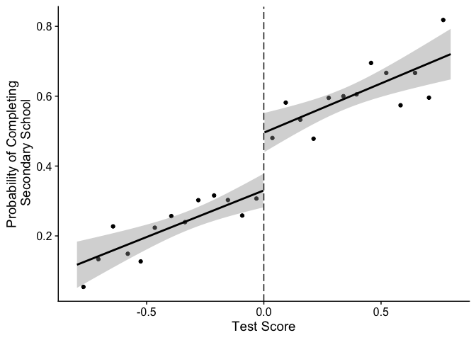

```r
here::i_am("HW5/HW5.Rmd")
```

```
## here() starts at /Users/johannaallen/Documents/Erik/ECON 587
```

```r
# Load packages
pacman::p_load(tidyverse, magrittr, rdd, ivreg)
```


```r
# Load data
oz_df = haven::read_dta(here::here('HW5', "data", "Ozier_JHR_Econ587.dta"))
```

### Question 1

#### a)


```r
# Generate indicator for treatment status. Treated if test > 0
oz_df = oz_df |>  mutate(treatment = if_else(test > 0, 1, 0))

# Regress secondary on test score, treatment, and interaction
oz_df %>% lm(secondary ~ test*treatment,.) |> broom::tidy()
```

```
## # A tibble: 4 × 5
##   term           estimate std.error statistic  p.value
##   <chr>             <dbl>     <dbl>     <dbl>    <dbl>
## 1 (Intercept)      0.330     0.0263    12.5   1.02e-34
## 2 test             0.267     0.0688     3.88  1.07e- 4
## 3 treatment        0.165     0.0377     4.38  1.24e- 5
## 4 test:treatment   0.0151    0.0967     0.157 8.76e- 1
```

#### c)


```r
# Define restrictions
restrict = c(0.8, 0.4, 0.2, 0.1)

lapply(restrict, function(x){
  oz_df |> filter(abs(test) < x) %>%
    lm(secondary ~ test*treatment,.) |> 
    broom::tidy()
})
```

```
## [[1]]
## # A tibble: 4 × 5
##   term           estimate std.error statistic  p.value
##   <chr>             <dbl>     <dbl>     <dbl>    <dbl>
## 1 (Intercept)      0.330     0.0263    12.5   1.02e-34
## 2 test             0.267     0.0688     3.88  1.07e- 4
## 3 treatment        0.165     0.0377     4.38  1.24e- 5
## 4 test:treatment   0.0151    0.0967     0.157 8.76e- 1
## 
## [[2]]
## # A tibble: 4 × 5
##   term           estimate std.error statistic  p.value
##   <chr>             <dbl>     <dbl>     <dbl>    <dbl>
## 1 (Intercept)       0.306    0.0358     8.56  3.28e-17
## 2 test              0.117    0.168      0.699 4.85e- 1
## 3 treatment         0.186    0.0521     3.57  3.71e- 4
## 4 test:treatment    0.186    0.237      0.783 4.34e- 1
## 
## [[3]]
## # A tibble: 4 × 5
##   term           estimate std.error statistic      p.value
##   <chr>             <dbl>     <dbl>     <dbl>        <dbl>
## 1 (Intercept)       0.283    0.0510     5.55  0.0000000409
## 2 test             -0.125    0.462     -0.271 0.786       
## 3 treatment         0.237    0.0752     3.15  0.00170     
## 4 test:treatment    0.196    0.663      0.295 0.768       
## 
## [[4]]
## # A tibble: 4 × 5
##   term           estimate std.error statistic  p.value
##   <chr>             <dbl>     <dbl>     <dbl>    <dbl>
## 1 (Intercept)       0.277    0.0724     3.83  0.000153
## 2 test             -0.281    1.26      -0.223 0.824   
## 3 treatment         0.224    0.114      1.97  0.0498  
## 4 test:treatment    0.506    1.99       0.254 0.799
```

#### d)


```r
# Estimate rdd. Note default standard errors are heteroskedastic robust
RDestimate(secondary ~ test, oz_df, cutpoint = 0) 
```

```
## 
## Call:
## RDestimate(formula = secondary ~ test, data = oz_df, cutpoint = 0)
## 
## Coefficients:
##      LATE    Half-BW  Double-BW  
##     0.181      0.227      0.171
```

#### e)


```r
# Plot rdd graph
oz_df |> group_by(a = cut(test, 26)) |> 
  summarise(secondary=mean(secondary), test = mean(test)) |> 
  ggplot(aes(test, secondary)) + 
    geom_point() + 
    geom_smooth(data = oz_df |> filter(test > 0), method = 'lm', col = 'black') +
    geom_smooth(data = oz_df |> filter(test < 0), method = 'lm', col = 'black') +
    geom_vline(xintercept = 0, lty = 5) + 
    xlab("Test Score") + ylab("Probability of Completing\n Secondary School") + 
    cowplot::theme_cowplot()
```

```
## `geom_smooth()` using formula = 'y ~ x'
## `geom_smooth()` using formula = 'y ~ x'
```

<!-- -->

```r
ggsave(here::here("HW5", "rdd_plot.pdf"))
```

```
## Saving 7 x 5 in image
## `geom_smooth()` using formula = 'y ~ x'
## `geom_smooth()` using formula = 'y ~ x'
```

#### f)


```r
# Rerun esimation of rdd, but override default kernal and bandwidths
RDestimate(secondary ~ test, oz_df, cutpoint = 0, kernel = 'rectangular', bw = 0.8)
```

```
## 
## Call:
## RDestimate(formula = secondary ~ test, data = oz_df, cutpoint = 0, 
##     bw = 0.8, kernel = "rectangular")
## 
## Coefficients:
##      LATE    Half-BW  Double-BW  
##     0.164      0.184      0.164
```

#### g)


```r
ivreg(rv ~ secondary + test + female + test:treatment | 
        treatment + test + female + test:treatment, data = oz_df) |> broom::tidy()
```

```
## # A tibble: 5 × 5
##   term           estimate std.error statistic  p.value
##   <chr>             <dbl>     <dbl>     <dbl>    <dbl>
## 1 (Intercept)       2.93     0.150      19.5  1.64e-77
## 2 secondary         0.726    0.311       2.33 1.98e- 2
## 3 test              0.612    0.159       3.85 1.22e- 4
## 4 female           -0.176    0.0483     -3.64 2.80e- 4
## 5 test:treatment   -0.311    0.133      -2.34 1.95e- 2
```

#### h)


```r
# Run estimate again, but use controls. Note the regressors are in the opposite order than the homework suggests. This is because the package wants the variables in the order running variable + endogenous treatment.
RDestimate(rv ~ test + secondary, oz_df, cutpoint = 0)
```

```
## 
## Call:
## RDestimate(formula = rv ~ test + secondary, data = oz_df, cutpoint = 0)
## 
## Coefficients:
##      LATE    Half-BW  Double-BW  
##      1.47       1.32       1.14
```

#### i)


```r
# Replicate g result. I don't include test interacted with treatment because it gives insane results like the LATE is 20 and I don't know why
RDestimate(rv ~ test + secondary | female , data = oz_df, cutpoint = 0,
           kernel = 'rectangular', bw = 0.6)
```

```
## 
## Call:
## RDestimate(formula = rv ~ test + secondary | female, data = oz_df, 
##     cutpoint = 0, bw = 0.6, kernel = "rectangular")
## 
## Coefficients:
##      LATE    Half-BW  Double-BW  
##     0.744      1.266      0.670
```


